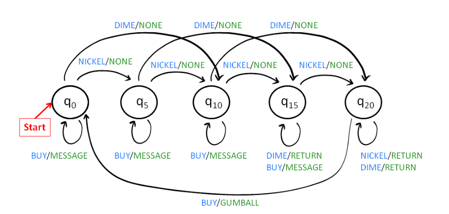

# Gumball Machine

## Specifications

Given enums:
- `Q` - Machine State
- `O` - Output Message
- `I` - Coin Type

___
`Requirements`:
- Create a CLI program that follows the requirements from `zyBooks - Requirements` file
- Simulates Gumball machine using Finite State Machine Requirements
___
## Machine State Diagram
